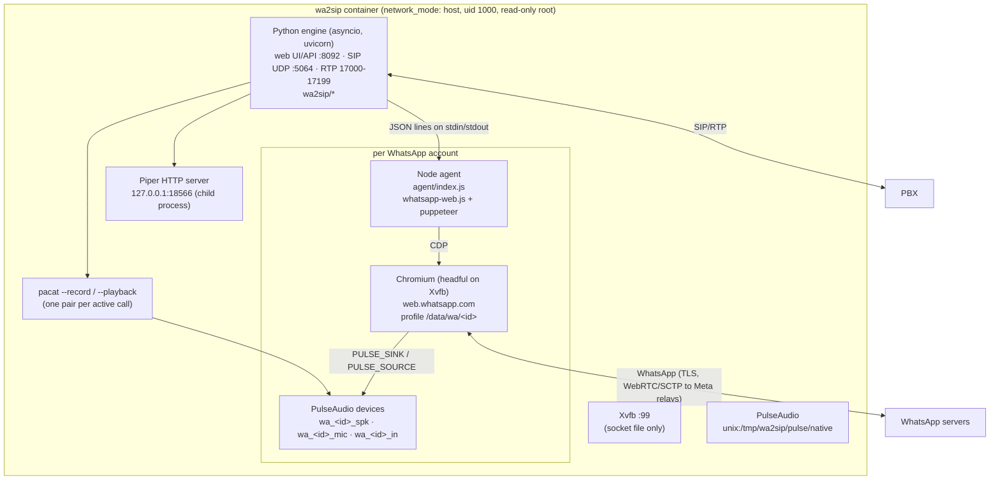
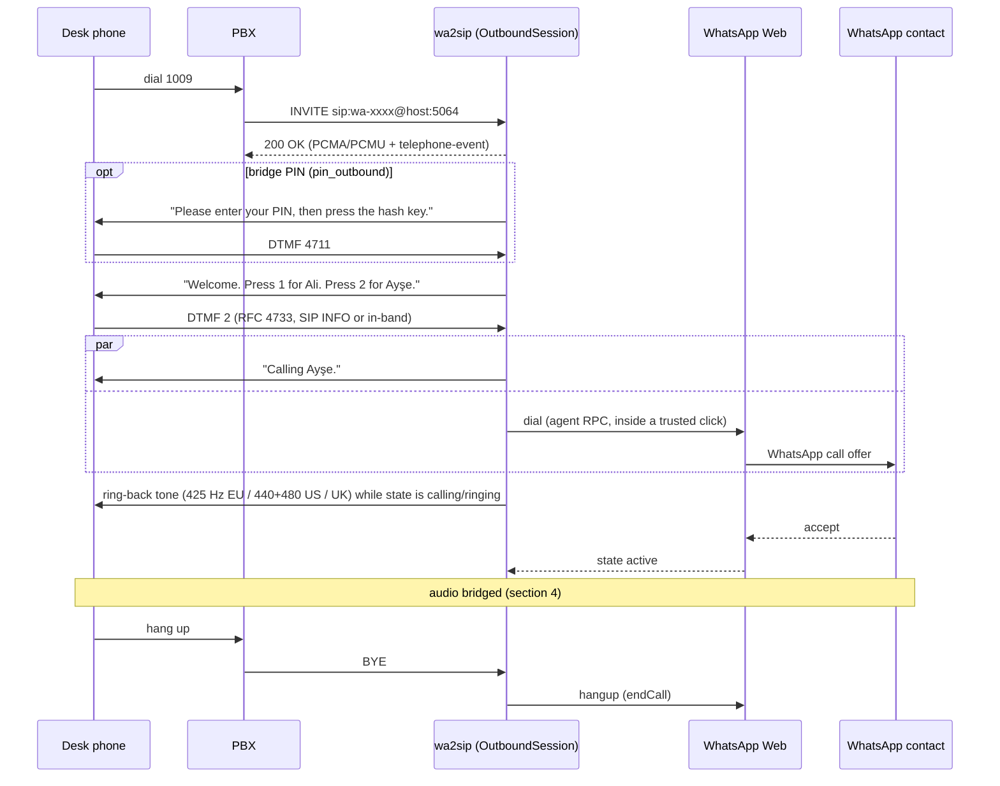
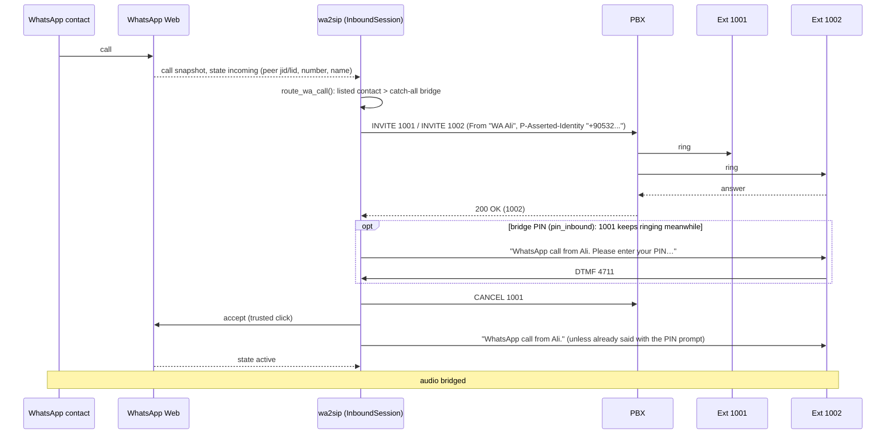

# Architecture

wa2sip joins two worlds:

- **WhatsApp**: a linked device (multi-device) session, driven through the official WhatsApp Web
  client running in Chromium, including its built-in calling (web.whatsapp.com, July 2026).
- **Telephony**: SIP registration and calls with G.711 RTP audio towards a PBX (FreePBX/Asterisk).

Everything runs in **one container** with host networking. The Python engine supervises all other
processes.

## 1. Runtime components



| Process | Started by | Restarted on exit | Notes |
|---|---|---|---|
| uvicorn + engine | container CMD (tini) | Docker `restart` | one asyncio loop for web, SIP, RTP, sessions |
| Xvfb `:99` | `wa/system.py` | yes (backoff) | `-nolisten tcp -nolisten local`: no TCP, **no abstract socket** (it would be shared with the host through host networking) |
| PulseAudio | `wa/system.py` | yes | `-n` (no default.pa), anonymous auth on a private socket, no suspend-on-idle |
| Node agent (one per account) | `wa/agent.py` | yes (3 s → 120 s backoff) | exits when its browser dies, so a crashed Chromium means a fresh agent |
| Chromium | the agent (puppeteer) | through the agent | sandbox on when user namespaces work (`seccomp-chromium.json`) |
| Piper | `media/piper.py` | on next use | GPL-3.0, only ever run as a separate program |
| pacat ×2 per call | `wa/pulse_audio.py` | no (per call) | G.711 in and out; PulseAudio resamples |

## 2. Code map

```
wa2sip/
  __main__.py        entry point (uvicorn)
  settings.py        WA2SIP_* environment variables
  models.py          pydantic config: Pbx, Extension, WaAccount, Bridge (+ BridgeContact, menu_codes, PIN), AppSettings
  pin.py             PinGuard: per-bridge wrong-PIN counting and lock-out
  store.py           JSON persistence (/data/config.json, call_history.json) + routing (route_wa_call, routing_conflict)
  engine.py          Engine: config -> SIP accounts + WhatsApp runtimes, call routing in both directions,
                     prompt rendering/caching, history, status
  sessions.py        SipLeg (paced RTP out, prompts/tones with priority, DTMF in), KeyBuffer, Session base (+ ask_pin),
                     OutboundSession (PBX -> IVR -> WhatsApp), InboundSession (WhatsApp -> ring PBX), normalize_number
  wa/
    base.py          WaRuntime interface, WaCall, WhatsApp CallState mapping, end reasons, AudioPipe
    manager.py       WaManager: one runtime per enabled account; sandbox probe; System lifecycle
    system.py        Xvfb + PulseAudio supervision, per-account virtual devices (pactl)
    agent.py         AgentRuntime: Node agent process, JSON-lines RPC + events, restart loop
    pulse_audio.py   PulsePipe: parec/pacat G.711 streams for one call
    fake.py          FakeRuntime/EchoPipe: simulated accounts (WA2SIP_WA_DRIVER=fake) for tests and demos
  sip/               SIP stack from cam-to-sip (message, auth, sdp, stack, ua); ua.dial() adds per-call
                     display name + P-Asserted-Identity
  media/             g711, rtp (Pacer jitter buffer), dtmf (Goertzel), tts (+ piper.py), tones (ringback)
  web/               FastAPI app (auth, API, static UI), auth.py (scrypt, sessions, LoginThrottle), static/ (vanilla JS SPA)
agent/
  index.js           the per-account agent: whatsapp-web.js client, QR/pairing, commands, events
  page.js            code injected into WhatsApp Web: call monitor, dial/accept/reject/hangup, contacts, diag
  probe.js           compatibility probe (weekly CI): are the WhatsApp Web internals still there?
  loopback.js        audio self-test page (mic -> speaker) used by tools/audio_loopback.py
  test/              node:test tests of page.js against a fake module registry
tests/               pytest: SIP, media, models/routing, engine sessions (in-process), web API, login security,
                     agent protocol (Python stand-in agent)
tools/
  e2e_fake.py        end-to-end through a real Asterisk with simulated WhatsApp (CI)
  audio_loopback.py  Chromium <-> PulseAudio <-> parec/pacat audio check (CI)
  test-pbx/          Asterisk image + config used by the e2e test
```

## 3. The WhatsApp side

### 3.1 Agent and protocol

`AgentRuntime` spawns `node agent/index.js` with the account id, profile dir and audio devices in its
environment. Messages are JSON lines:

```
engine -> agent   {"id": 7, "cmd": "dial", "args": {"to": "905321234567"}}
agent -> engine   {"id": 7, "ok": true, "result": {...call snapshot...}}
                  {"id": 7, "ok": false, "code": "not_on_whatsapp", "error": "..."}
agent -> engine   {"event": "state", "state": "qr|loading|authenticated|ready|disconnected|failed", "detail": ""}
                  {"event": "qr", "qr": "data:image/png;base64,..."}   {"event": "pairing_code", "code": "ABCD1234"}
                  {"event": "me", "me": {...}}   {"event": "diag", "diag": {...}}
                  {"event": "call", "call": {...snapshot...}}   {"event": "log", "level": "info", "msg": "..."}
```

Commands: `contacts`, `lookup`, `dial`, `accept`, `reject`, `hangup`, `diagnostics`, `screenshot`,
`pairing_code`, `logout`, `shutdown`. stdout is reserved for the protocol: the agent redirects every
`console.*` call to stderr, which the engine logs at DEBUG.

### 3.2 Linking and session

- whatsapp-web.js (pinned to a GitHub commit, see `agent/package.json`) launches Chromium with
  `LocalAuth` (profile in `/data/wa/<id>/session-<id>`), `userAgent: false` (the real Chromium UA)
  and `takeoverOnConflict`. It emits `qr`, `code` (pairing), `authenticated` and `ready`.
- If `ready` never comes (a known whatsapp-web.js stall), the agent carries on 90 s after
  `authenticated`.
- **Unlink** calls `WAWebSocketModel.Socket.logout()` in the page; `client.logout()` would close the
  browser.
- The agent removes stale `Singleton*` locks before start (Chromium crashed, container killed).

### 3.3 Calls through WhatsApp Web's own VoIP stack (`agent/page.js`)

All internals were read from WhatsApp Web 2.3000.1049x. [docs/whatsapp-web-internals.md](docs/whatsapp-web-internals.md)
has the details and how to re-check them.

| Action | How |
|---|---|
| observe | poll (200 ms) `WAWebCallCollection` (`getModelsArray()` + `activeCall`); emit a snapshot when a model's `getState()` changes or it disappears |
| dial | resolve the target (`WAWebQueryExistsJob.queryPhoneExists('+<digits>')` or `WAWebWidFactory.createWid(id)`), then `WAWebVoipStartCall.startWAWebVoipCall(wid, false, CALL_FROM_UI.CONVERSATION, 0, null, {entryTrust: 'user_gesture'})`; wait for `activeCall.outgoing` |
| accept | `WAWebCallRingtone.stopCallRingtone()`, `WAWebVoipAcquireMediaStream.checkVoipDevicePermissions(false, call)`, then `(await WAWebVoipStackInterface.getVoipStackInterface()).acceptCall(true /*audio*/, false /*video*/)` |
| reject | `stack.rejectCall()` |
| hang up | `stack.endCall(EndCallReason.Self /*2*/, true)` |

This mirrors what WhatsApp Web's own buttons do (`useWAWebVoipCallHandlers`, `WAWebExecApiCmdNewCall`).

- **User activation.** `dial` and `accept` run inside a *trusted* mouse click: the agent clicks a
  6×6 px transparent button that `page.js` adds. Some browser APIs on WhatsApp's path (popups,
  picture-in-picture, audio) need a user gesture.
- **Microphone.** The agent grants `microphone` for web.whatsapp.com through CDP and runs Chromium
  with `--use-fake-ui-for-media-stream`. That flag only auto-accepts the prompt; the device is real.
  With `RAW_MIC` (default), a `getUserMedia` wrapper turns off echo cancellation, noise suppression
  and AGC: the "mic" is a clean digital feed and there is no acoustic echo.
- **Message sounds** are switched off in this WhatsApp Web session (`MuteCollection.setGlobalSounds(false)`),
  because they would play into a bridged call.
- **Call state mapping** (`wa/base.py`, `WAWebVoipWaCallEnums.CallState`):

  | WhatsApp | wa2sip |
  |---|---|
  | 1 Calling, 12 PreCalling, 14 | `calling` |
  | 2 PreacceptReceived | `ringing` (a device of the peer rings) |
  | 3 ReceivedCall, 8 ReceivedCallWithoutOffer | `incoming` |
  | 4 AcceptSent, 5 AcceptReceived | `connecting` |
  | 6 CallActive, 11 ConnectedLonely | `active` |
  | 7 CallActiveElseWhere | `elsewhere` (answered on another device: ends our side) |
  | 0 None, 13 CallStateEnding, or model removed | `ended` |

  End reasons come from `peerBusy`, `wasEverConnected`, `callLogResult` (3 declined, 5 unavailable, …)
  and `callFailedReason`.

### 3.4 Diagnostics

- **Browser view**: a JPEG of the WhatsApp Web tab (`page.screenshot`).
- **Diagnostics**: WhatsApp version, socket state, `SharedArrayBuffer`/`crossOriginIsolated`/
  `RTCPeerConnection` (WhatsApp's VoIP prerequisites), the `enable_web_calling` AB prop (must be true
  once linked), presence of every module wa2sip uses, and the active call.
- **`agent/probe.js`** checks the modules logged out (no account needed), runs weekly in CI, and can
  print any module's source (`--source <name>`) for re-reverse-engineering.

## 4. Audio

```
WhatsApp peer ─► Chromium (WhatsApp Web VoIP) ─► wa_<id>_spk (null sink, 48 kHz mono)
   ─► monitor ─► pacat --record --format=alaw|ulaw --rate=8000  ─► 160-byte frames ─► Pacer ─► RTP ─► PBX

PBX ─► RTP ─► pacat --playback --format=alaw|ulaw --rate=8000 ─► wa_<id>_mic (null sink)
   ─► wa_<id>_in (remap of its monitor = Chromium's default microphone) ─► WhatsApp Web ─► peer
```

- Chromium gets `PULSE_SINK=wa_<id>_spk` and `PULSE_SOURCE=wa_<id>_in`, so each account has its own
  devices.
- The pacat pair is started with the SIP call's codec (PCMA → `alaw`, PCMU → `ulaw`), so Python never
  converts samples: PulseAudio does the G.711 ↔ float and 8 ↔ 48 kHz work.
- The playback side drops audio instead of buffering when more than 1 s is queued (`MAX_PLAY_BACKLOG`).
- Measured with `tools/audio_loopback.py` (Chromium page mic → speaker): ~100 ms round trip through
  both pipes, no level loss, 1 kHz tone intact (65+ dB above other frequencies).
- On the SIP side `SipLeg` sends one 20 ms frame per tick from the `Pacer`. Prompts win over looping
  tones, and tones win over WhatsApp audio. The pacer buffer is flushed when the call connects so
  nothing stale plays.

## 5. Call flows

### 5.1 PBX → WhatsApp (calling the bridge's extension)



- **PIN** (`Session.ask_pin`, when `pin_outbound`): asked first, before WhatsApp's state is revealed.
  Keys until `#` (or a 5 s pause), `*` starts over, max 16 digits; keys typed during the prompt count.
  `pin_attempts` tries per call, then *"Wrong PIN." "Goodbye."* and BYE (history: `wrong PIN`).
- **Menu codes** (`Bridge.menu_codes()`, mirrored in the UI): explicit keys first, then `1-9`, or
  `10-99` for all contacts when there are more than nine entries. Codes stay prefix-free, and the
  dial-number key is reserved. The collector returns as soon as a code is unambiguous and waits
  2.5 s between keys otherwise.
- **Barge-in**: any key stops the current prompt, and a key pressed during a prompt skips the next
  menu replay.
- **Dial a number**: key `dial_digit` → *"Enter the number…"* → digits until `#` (or a 6 s pause,
  `*` restarts). `00…` is stripped, and a leading national prefix becomes `country_code`.
- **Failures** are spoken: declined/unavailable/no answer → `ivr_failed_text`, busy → `ivr_busy_text`,
  not on WhatsApp → `ivr_not_on_wa_text`, account busy/offline → `ivr_wa_busy_text` /
  `ivr_offline_text`. After a failure the menu plays again; after `ivr_repeats` misses: goodbye + BYE.
- **While WhatsApp rings or during the call** the menu key (`*`) hangs up WhatsApp and returns to the
  menu (only when a menu exists). When WhatsApp ends, `after_call` decides: hang up, or menu.
- **Single contact, no dial option, `menu_always` off**: the contact is called straight away.
- When the PBX side hangs up, the session task is cancelled at once (`OutboundSession.run` races the
  main flow against `call.ended`), so cleanup and history don't wait for a prompt or digit timeout.

### 5.2 WhatsApp → PBX (incoming WhatsApp call)



- **PIN** (`pin_inbound`): every extension that picks up gets its own `SipLeg` + `KeyBuffer` and is
  asked for the PIN (after the announcement) while the others keep ringing. The first right PIN wins
  and WhatsApp is answered only then. A wrong PIN hangs up that phone only. If nobody unlocks the
  call, it ends like an unanswered one (history: `wrong PIN`). No audio goes to WhatsApp before it is
  answered.
- Ring targets come from the contact's `ring` list, else the bridge's `ring_targets`. All of them are
  called in parallel through the bridge's extension account; the first 200 OK wins and the rest get
  CANCEL.
- If nobody answers within `ring_timeout`, the WhatsApp call is declined (`reject_unanswered`) or left
  ringing on the phone. If the WhatsApp caller hangs up first, all forks are cancelled.
- If the extension isn't registered or has no ring targets, the call is **left alone**: it keeps
  ringing on your phone.
- Not bridged at all (no listed contact, no catch-all): left alone, or declined when the account's
  `unrouted` is `reject`. Group calls are always left alone. While a bridged call runs on an account,
  further WhatsApp calls aren't routed: WhatsApp Web's call waiting applies.
- **Caller ID:** the From display name is `caller_name` (`WA {name}`). The P-Asserted-Identity
  carries the same name and `+<WhatsApp number>` (or the extension, `caller_number: extension`).
  Asterisk replaces From with the endpoint's own callerid **unless** the endpoint has
  `trust_id_inbound=yes` (FreePBX: *Trust RPID/PAI*). The e2e test PBX shows both behaviours.
- Cleanup never declines a call we didn't accept (`accepted` flag); an accepted call is hung up
  with `endCall`, never `rejectCall`.

## 6. Routing rules (`store.py`)

- One enabled bridge per extension: the extension identifies the bridge for PBX → WhatsApp calls.
- **PinGuard** (`pin.py`, in memory): wrong PINs are counted per bridge across calls and both
  directions. After 10 in a row the PIN locks for 60 s, doubling per further wrong PIN up to 1 h;
  while locked, every PIN (the right one too) gets *"Wrong PIN"*. A right PIN resets the count.
  Comparison is constant-time; PIN digits are never logged (DTMF debug logs show `•` in the PIN
  phase).
- Per WhatsApp account, an inbound contact (matched by `wa_id` in {jid, lid, `<number>@c.us`} or by
  number) may be listed on only one enabled, inbound-enabled bridge. At most one catch-all bridge
  per account.
- Menu keys must be unique within a bridge.
- `check_bridge()` in the API also requires ring targets when inbound routing could need them.

## 7. SIP stack

Shared with cam-to-sip: RFC 3261 subset over UDP (one socket for all extensions; inbound INVITEs are
routed by the unique Contact user `wa-xxxxxxxx`). It covers REGISTER with digest (MD5/SHA-256),
UAS/UAC dialogs, CANCEL, re-INVITE, INFO DTMF, RFC 4733, symmetric RTP and G.711 only. The scope
table and the reasoning are in cam-to-sip's ARCHITECTURE §6. wa2sip adds per-call From display
names and `P-Asserted-Identity` in `Account.dial()`.

## 8. Text-to-speech

`media/tts.Tts.pcm(text, voice, speed)`: voice ids `piper:<key>` use Piper (downloaded on demand
from rhasspy/piper-voices into `/data/voices`, HTTP server child process). Other ids use espeak-ng.
Results are cached as 8 kHz PCM, and the engine caches G.711 per codec. After every config change
`Engine._prewarm()` downloads the voices in use and renders all prompts of all enabled bridges
(menu, failures, per-contact calling/announcement texts), so calls don't wait for synthesis.
Speed is in words per minute; Piper gets `length_scale = 165 / wpm`.

## 9. Web UI, API and security

FastAPI serves `/api/*` and a vanilla-JS SPA (`web/static`, no build step). Auth is carried over
from cam-to-sip:

- scrypt password hash; HMAC session cookie bound to the hash (a password change logs everyone out);
  `SameSite=strict`; `Secure` behind a trusted HTTPS proxy.
- Bearer API token for automations.
- `LoginThrottle` per IP and per account (charged before scrypt, refunded on success).
- Fetch-metadata cross-site refusal.
- uvicorn's proxy headers off; `ProxyHeadersMiddleware` with `TRUSTED_PROXIES`.
- Secrets (`password`) are write-only in the API (`""` + `password_set`).
- No WebSockets: the UI polls `/api/status`, `/api/wa` and `/api/logs`.

Container hardening (compose): `seccomp-chromium.json` (Docker default + userns syscalls), so
Chromium keeps its sandbox; `no-new-privileges`, `cap_drop: ALL`, `read_only` with tmpfs `/tmp` and
`/home/wa2sip`, uid 1000, `/data` mode 0700. [docs/security.md](docs/security.md) has more.

## 10. How it is tested

| What | How | Where |
|---|---|---|
| SIP stack, media, DTMF, models, routing, API, auth | pytest | `tests/` |
| Sessions both directions, IVR, ring-back, failures, unrouted calls | in-process engine + fake WhatsApp + SIP phone UA | `tests/test_engine.py` |
| Agent protocol, crash/restart | Python stand-in for the Node agent | `tests/test_agent_protocol.py` |
| page.js call control and contacts | node:test against a fake WhatsApp Web module registry | `agent/test/` |
| PBX interop (Asterisk 20): registration, IVR, RFC 4733 DTMF (also from an in-band-only phone), PAI, CANCEL; the in-band detector itself is unit tested | real Asterisk + wa2sip image + fake WhatsApp | `tools/e2e_fake.py` (CI) |
| Chromium ↔ PulseAudio ↔ parec/pacat, sandbox on | real Chromium page looping mic to speaker | `tools/audio_loopback.py` (CI) |
| WhatsApp Web internals still present | logged-out WhatsApp Web | `agent/probe.js` (weekly CI) |
| Real WhatsApp calls | **not automated**: needs a linked phone | manual, see CLAUDE.md |

## 11. Design decisions

| Decision | Why |
|---|---|
| Official WhatsApp Web in Chromium, not a reimplemented VoIP stack | WhatsApp Web has had calling since July 2026. Driving it means Meta's own signalling, encryption and codecs (MLow/Opus over their relays) and the least ban risk. The pure-Go alternative (meowcaller, Jun 2026) had open bugs on exactly our main paths: inbound audio on linked devices, and calls to peers with WhatsApp Web open. |
| whatsapp-web.js for the session, own page code for calls | wwebjs handles QR/pairing/auth/re-injection well and is maintained. It has no call control (only reject), so `page.js` uses WhatsApp Web's modules directly, defensively, behind one small API. |
| Audio through PulseAudio devices, not JS hooks | Agnostic to how WhatsApp Web plays and captures audio (WASM VoIP, AudioWorklets, `<audio>`). No monkey-patching of WhatsApp's media path, and testable with any web page (`audio_loopback.py`). |
| Headful Chromium on Xvfb | Closest to a desktop browser (visibility, UA, audio); headless can be detected and changes media behaviour. `WA2SIP_XVFB=false` switches to `--headless=new`. |
| One container, Python as supervisor | One `docker compose up`. Host networking is needed for SIP/RTP anyway, and the processes share the Pulse socket. |
| Python engine with cam-to-sip's SIP stack | Proven against FreePBX 17, small, fully under our control (forked ringing, PAI, prompts on the RTP clock). |
| G.711 only | Every PBX supports it, and PulseAudio does all conversion. WhatsApp's wideband audio is narrowed to 8 kHz (fine for desk phones). |
| Prompts pre-rendered | Piper takes ~0.2 s per sentence; menus are rendered on save, so a caller never waits. |

## 12. Known limitations and ideas

- Real WhatsApp call control is unverified against a linked phone (see the README status note).
  The most likely failure points, in order: `enable_web_calling` false for the session; `acceptCall`
  signature changes; `startWAWebVoipCall` consent flow; audio device selection. CLAUDE.md has the
  debugging playbook.
- One call per WhatsApp account. Several accounts can each have a call at the same time.
- G.722/wideband to the PBX, SIP over TCP/TLS, SRTP: not implemented.
- Ideas: click-to-call from the web UI (ring an extension, then dial WhatsApp); per-caller PIN
  for bridges; announcing who is calling on WhatsApp while still ringing (early media); voicemail
  for unanswered WhatsApp calls; WhatsApp messages as SIP MESSAGE.
