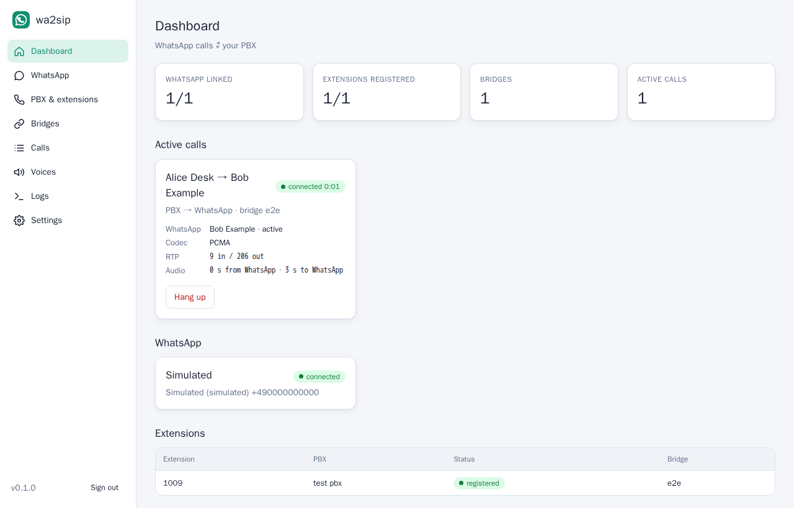
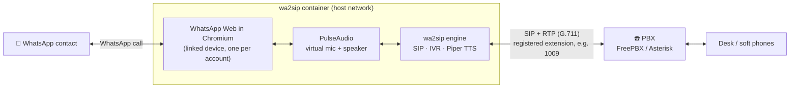
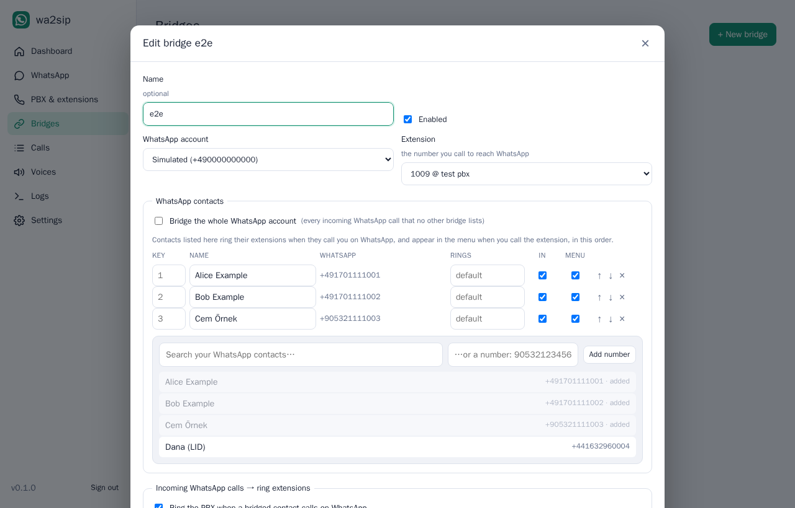

# wa2sip

**Bridge WhatsApp voice calls to your PBX.** wa2sip links to your WhatsApp as a *linked device*
(like WhatsApp on a computer) and registers extensions on your PBX (FreePBX, Asterisk, …):

- **WhatsApp → desk phone:** when someone calls you on WhatsApp, your PBX extensions ring. Pick up
  on any SIP phone and talk.
- **Desk phone → WhatsApp:** call the bridge's extension (say **1009**) and a natural-sounding voice
  says *"Press 1 for Ali, press 2 for Ayşe…"*. Press a key and wa2sip calls that contact on WhatsApp.
  Optionally, dial any phone number.

You can bridge **the whole WhatsApp account to one extension**, or **this person to that extension
and that person to another one**. The voice prompts use [Piper](https://github.com/OHF-Voice/piper1-gpl)
neural voices, which run offline on your server.

Everything is one Docker Compose service with a web UI.



> **Status:** v0.1. Linking, the PBX side, the IVR, the audio path and call routing are tested
> end-to-end (real Asterisk, real Chromium + PulseAudio, simulated WhatsApp). Placing and answering
> *real* WhatsApp calls drives WhatsApp Web's own calling code (available on web.whatsapp.com since
> July 2026) through its internal modules. That part could only be checked against the WhatsApp
> Web code, not with a linked phone, so please report what happens on your account
> (see [Troubleshooting](docs/troubleshooting.md)).

## How it works



- wa2sip runs the **real WhatsApp Web** in Chromium for each linked account. WhatsApp Web places and
  answers the calls itself, so calls use WhatsApp's own encryption and codecs. There's no
  reverse-engineered VoIP stack.
- Chromium's speaker and microphone are virtual PulseAudio devices. wa2sip connects them to the SIP
  call: WhatsApp audio goes to RTP, and RTP goes to the WhatsApp "microphone".
- The SIP side is a small user agent written for this project, the same one as in
  [cam-to-sip](https://github.com/revocx35/cam-to-sip). It registers extensions, answers calls,
  rings extensions, handles DTMF and plays prompts.

Details: [ARCHITECTURE.md](ARCHITECTURE.md).

## Requirements

- Docker with Compose, on Linux (amd64 or arm64). wa2sip uses **host networking** for SIP/RTP.
- A PBX where you can create one SIP extension per bridge (FreePBX, Asterisk, 3CX, …), reachable
  over UDP.
- About 700 MB of RAM per linked WhatsApp account (Chromium) plus ~250 MB for the engine and voices.
- Your phone with WhatsApp, to link the account (QR code or phone number).

## Quick start

```bash
git clone https://github.com/revocx35/wa2sip && cd wa2sip
cp .env.example .env          # optional: ports, admin password
docker compose up -d --build
```

Or use the prebuilt image (no checkout):

```bash
mkdir wa2sip && cd wa2sip
curl -fsSLO https://raw.githubusercontent.com/revocx35/wa2sip/main/deploy/docker-compose.yml
curl -fsSLO https://raw.githubusercontent.com/revocx35/wa2sip/main/seccomp-chromium.json
docker compose up -d
```

Open `http://<server>:8092`, choose an admin password, then:

1. **WhatsApp** → *Add WhatsApp account* → scan the QR code in WhatsApp → *Settings → Linked
   devices → Link a device* (or use *link with your phone number*).
2. **PBX & extensions** → add your PBX (host/IP, port) and an extension for wa2sip, e.g. `1009`
   with its secret. Create it on the PBX first: [FreePBX guide](docs/freepbx.md).
3. **Bridges** → *New bridge*: pick the WhatsApp account and the extension, then add contacts or tick
   *Bridge the whole WhatsApp account*, set which extensions ring (e.g. `1001`), and adjust the menu.

Call `1009` from a desk phone and you hear the menu. Ask someone to call you on WhatsApp and `1001`
rings.



## Bridges

A bridge connects one WhatsApp account with one extension that wa2sip registers.

| Setting | What it does |
|---|---|
| **Contacts** | Searchable picker over your WhatsApp contacts, or any number. Each contact gets a menu key (automatic 1-9, or 10-99 for big menus, or your own), can ring its own extensions, and can be left out of the menu or out of incoming routing. |
| **Bridge the whole WhatsApp account** | Every incoming WhatsApp call that no other bridge lists rings this bridge's extensions. At most one such bridge per account. |
| **Ring these extensions** | Incoming WhatsApp calls ring all of them at once. The first to answer gets the call and the others stop ringing. Each contact can override this. |
| **Caller name / number** | Shown on the ringing phone, e.g. `WA Ali` / `+905321234567`. Needs *Trust RPID/PAI* on the extension (see the [FreePBX guide](docs/freepbx.md)). |
| **Announce the caller** | After you pick up you hear *"WhatsApp call from Ali"*, then the call connects. |
| **Menu** | Greeting plus one line per contact, in the voice and speed you choose. **▶ Preview menu** plays it. With a single contact and no other option, the contact is called directly. |
| **Dial any number** | Menu key (default `0`): enter a number and press `#`. Numbers starting with the national prefix (e.g. `0532…`) get your country code; `00…` works too. |
| **During the call** | `*` hangs up WhatsApp (or cancels it while it rings) and returns to the menu, when there is a menu. The caller hears a ring tone while WhatsApp rings, and a spoken message if the contact declines, is busy or doesn't answer. |
| **PIN** | 4-16 digits, typed followed by `#`. Callers of the extension enter it before the menu, and whoever picks up an incoming WhatsApp call enters it before WhatsApp is answered (the other extensions keep ringing meanwhile). Each direction can be turned off. After 10 wrong PINs in a row the bridge's PIN locks for a minute, doubling up to an hour. |
| **Allowed callers** | Restrict which PBX extensions may use the bridge. |

Examples:

- *Whole WhatsApp to one extension:* tick **Bridge the whole WhatsApp account**, ring `1001`, and add
  your favourite contacts for the menu.
- *Per person:* bridge A (extension `1009`) with Mom and Dad ringing `1001`; bridge B (extension
  `1010`) with work contacts ringing `2001`. Or one bridge where each contact has its own *Rings*.

## Voices

Prompts are spoken by Piper neural voices (natural sounding, offline, many languages including
Turkish, German and English). A voice downloads automatically (20-120 MB, once) when you choose it.
Pick the default voice and ring tone on the **Voices** page, and override the voice per bridge.
espeak-ng is the fallback when no natural voice is available.

## Configuration

Environment variables (`.env`, see [.env.example](.env.example)):

| Variable | Default | Meaning |
|---|---|---|
| `WEB_PORT` | `8092` | Web UI / API port |
| `ADMIN_PASSWORD` | – | First admin password (otherwise set on first visit) |
| `SIP_PORT` | `5064` | Local UDP port for SIP (all extensions share it) |
| `RTP_PORT_MIN` / `MAX` | `17000` / `17199` | RTP audio ports |
| `ADVERTISE_IP` | auto | IP put into SIP/SDP (set it if the PBX must reach another address) |
| `PIPER_PORT` | `18566` | Local port of the Piper helper (127.0.0.1) |
| `LOG_LEVEL` | `INFO` | `DEBUG` for more detail |
| `SIP_TRACE` / `WA_TRACE` | `false` | Log every SIP message / every WhatsApp call state |
| `WA_DRIVER` | `chromium` | `fake` = simulated WhatsApp accounts, to try the PBX side without WhatsApp |
| `CHROMIUM_SANDBOX` | `auto` | Chromium's sandbox (needs `seccomp-chromium.json`, see [security](docs/security.md)) |
| `TRUSTED_PROXIES` | `private` | Reverse proxies allowed to set `X-Forwarded-For` |
| `SECURE_COOKIES` | `auto` | `Secure` cookie flag behind an HTTPS proxy |

Everything else (PBX, extensions, accounts, bridges, voices) is configured in the web UI and stored
in the `wa2sip-data` volume (`/data`). The WhatsApp sessions live there too, so updates and restarts
keep you linked.

## Security notes

- The web UI has one admin password (scrypt, brute-force throttling, `SameSite=strict` session
  cookie, cross-site request checks). Put it behind HTTPS (e.g. Nginx Proxy Manager) if you expose it.
- Anyone with the admin password can read your WhatsApp contacts and place WhatsApp calls. Treat it
  like your phone's PIN.
- Anyone who can call a bridge's extension can make WhatsApp calls through it. Give bridges a
  **PIN** (and/or *Allowed callers*) if your PBX has users or trunks you don't fully trust.
- Chromium shows content from strangers (WhatsApp Web), so it keeps its **sandbox** on via
  `seccomp-chromium.json`. The container also runs as non-root with a read-only root filesystem and
  no capabilities. See [docs/security.md](docs/security.md).
- `/data` holds the WhatsApp sessions and the SIP secrets: back it up privately.

## Limitations

- 1:1 **voice** calls only. A video call is answered as voice; group calls are left to your phone.
- One bridged call per WhatsApp account at a time (WhatsApp Web allows one call). A second caller
  hears *"WhatsApp is busy"*.
- Audio is G.711 (8 kHz narrowband) towards the PBX.
- wa2sip uses WhatsApp Web's internal modules. WhatsApp updates can break them; a weekly CI job
  ([probe](agent/probe.js)) checks they still exist.
- Using unofficial clients may be against WhatsApp's terms. wa2sip uses the official web client, as
  a person would, but use it at your own risk.

## Development

```bash
docker build -t wa2sip-dev -f Dockerfile.dev .
docker run --rm -v $PWD:/src wa2sip-dev python -m pytest -q            # Python tests
docker run --rm -v $PWD/agent:/a -w /a node:22-trixie-slim sh -c "npm ci && npm test"   # agent tests
```

End-to-end with a real Asterisk and simulated WhatsApp, and the audio path through Chromium: see
[CLAUDE.md](CLAUDE.md#commands). More docs: [architecture](ARCHITECTURE.md),
[FreePBX](docs/freepbx.md), [troubleshooting](docs/troubleshooting.md),
[WhatsApp Web internals](docs/whatsapp-web-internals.md), [security](docs/security.md).

## License

MIT. Piper (GPL-3.0) runs as a separate program; whatsapp-web.js is Apache-2.0.
Not affiliated with WhatsApp or Meta.
